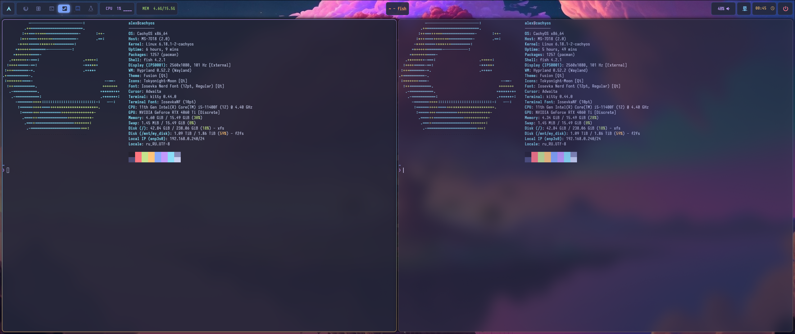

# 🌌 Hyprland Dotfiles: Futuristic Tokyo Night

Добро пожаловать в мой репозиторий с конфигурациями для Hyprland! Это рабочее окружение, настроенное в стиле "Futuristic Tokyo Night" — сочетание глубоких темных тонов и неоновых акцентов.

## 📸 Скриншоты

*Основной рабочий стол: Hyprland + Waybar + Kitty*

---

## 🚀 Быстрая установка (Arch Linux)

Я написал скрипт автоматизации, который сам установит нужные пакеты и создаст символьные ссылки.

1. **Клонируйте репозиторий:**
   ```bash
   git clone [https://github.com/deadpony228/Hyprland-dotfiles-in-fututristc-style.git](https://github.com/deadpony228/Hyprland-dotfiles-in-fututristc-style.git)
   cd Hyprland-dotfiles-in-fututristc-style

    Запустите установщик:
    Bash

    chmod +x install.sh
    ./install.sh

🛠 Компоненты системы

| Компонент | Инструмент | Описание |
| :--- | :--- | :--- |
| **Window Manager** | [Hyprland](https://hyprland.org/) | Динамический тайлинг на Wayland |
| **Terminal** | [Kitty](https://sw.kovidgoyal.net/kitty/) | Быстрый терминал с поддержкой GPU |
| **Panel** | [Waybar](https://github.com/Alexays/Waybar) | Настраиваемая статус-панель |
| **App Launcher** | [Wofi](https://hg.sr.ht/~scoopta/wofi) | Меню запуска приложений и команд |
| **Wallpaper** | [SWWW](https://github.com/L_S_D/swww) | Демон для анимации и смены обоев |
| **Fonts** | Iosevka Nerd Font | Шрифты с иконками для терминала |

Я настроил удобные сочетания клавиш для продуктивности:

    PrintScreen — Скриншот области в буфер обмена (grim + slurp)

    Super + Q — Запуск терминала Kitty

    Super + R — Меню приложений (Wofi)

    Super + M — Меню питания (Power Menu)

    Super + E — Файловый менеджер

📁 Структура папок

    hypr/ — Конфигурация Hyprland и кастомные скрипты.

    waybar/ — Стили и структура верхней панели.

    kitty/ — Настройки терминала и цветовая схема.

    wofi/ — Стилизация меню запуска.

    screenshots/ — Галерея внешнего вида системы.
